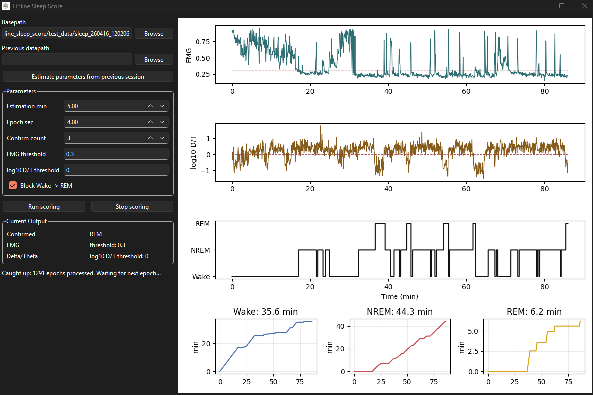

# online_sleep_score

Python GUI for online sleep-state scoring from Intan-style recordings.



## Install on Windows

1. Open the latest release:
   https://github.com/yoshihito-saito/online_sleep_score/releases
2. Download `OnlineSleepScore-Windows.zip`.
3. Unzip it.
4. Open the `OnlineSleepScore` folder and double-click:

```text
OnlineSleepScore.exe
```

Keep the full `OnlineSleepScore` folder together. Do not move only the `.exe` file, because the app needs the `_internal` folder next to it.

## Input

Select a recording folder containing:

- `amplifier.dat`
- `amplifier.xml`

## Workflow

1. Choose `Basepath`.
2. Optionally choose `Previous datapath`.
3. Press `Estimate parameters from previous session` to fill thresholds from a previous recording.
4. Adjust thresholds if needed.
5. Press `Run scoring`.

If previous parameters are estimated, the app uses the previous-session EMG, SW, and theta channels and skips the current-session `Estimation min` step.

If previous parameters are not estimated, the app estimates channels from the first `Estimation min` minutes of the current recording.

## Output

Results are saved in the recording folder:

```text
<basename>.OnlineSleepState.states.mat
```

The MAT file contains:

- `SleepState`
- `OnlineSleepFeatures`
